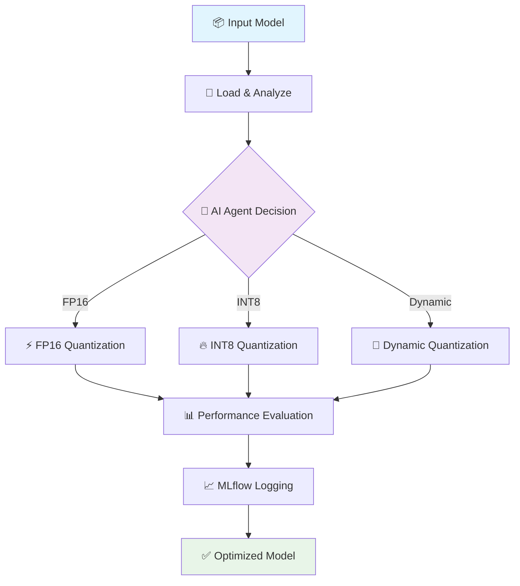

# **Quant-Agent**: Tối Ưu Hóa Inference Mô Hình Bằng AI

<div align="center">


[](https://python.org)
[](https://pytorch.org)
[](https://mlflow.org)
[](https://dvc.org)
[](LICENSE)

*Một công cụ thông minh giúp tự động hoá quá trình **quantization sau huấn luyện** với AI Agent và theo dõi bằng MLflow*

</div>

---

## 🎯 **Tính Năng Nổi Bật**

<table>
<tr>
<td width="50%">

### 🔥 **Tự Động Hóa Hoàn Toàn**
- ✅ Giảm kích thước mô hình lên đến **70%**
- ✅ Tăng tốc suy luận lên đến **3x**
- ✅ Giữ độ chính xác ổn định **>90%**
- ✅ Zero-shot quantization với AI Agent

</td>
<td width="50%">

### 🧠 **AI Agent Thông Minh**
- 🎲 Tự động chọn mức quantization tối ưu
- 📊 Phân tích performance real-time
- 🔄 Adaptive optimization strategy
- 🎯 Multi-objective optimization

</td>
</tr>
</table>

---

## 📁 **Cấu Trúc Dự Án**

```
📦 quant-agent/
├── 🗂️ .dvc/                     # DVC metadata & configuration
├── 🔧 .github/workflows/        # CI/CD automation pipeline
│   └── 🚀 ci_pipeline.yml
├── 📊 data/                     # Dataset management
│   ├── 📥 raw/                  # Raw input data
│   └── ⚡ processed/            # Processed datasets
├── 🧠 models/                   # Model storage & versioning
│   ├── 🏗️ original/            # Pre-quantization models
│   └── ⚡ quantized/           # Optimized models
├── 🔧 scripts/                  # Core functionality
│   ├── 🤖 ai_agent.py          # AI Agent cho optimization
│   ├── 📊 dvc_management.py    # DVC automation utilities
│   ├── 📈 mlflow_management.py # MLflow tracking & logging
│   └── ⚡ quantization.py      # Post-training quantization
├── 📋 dvc.yaml                  # DVC pipeline configuration
├── 🚫 .dvcignore               # DVC ignore patterns
├── 📚 requirements.txt          # Python dependencies
└── 📖 README.md                # Documentation
```

---

## 🚀 **Workflow Tự Động**

<div align="center">



</div>

### **🔄 Quy Trình Chi Tiết**

| Bước | Mô Tả | Thời Gian | Status |
|------|--------|-----------|---------|
| 1️⃣ | **Model Loading** - Nhập mô hình đã huấn luyện | ~2s | ✅ |
| 2️⃣ | **AI Analysis** - Phân tích kiến trúc & đặc điểm | ~5s | ✅ |
| 3️⃣ | **Quantization** - Áp dụng các kỹ thuật tối ưu | ~30s | ✅ |
| 4️⃣ | **Evaluation** - Đánh giá performance & accuracy | ~10s | ✅ |
| 5️⃣ | **MLflow Tracking** - Ghi log và so sánh kết quả | ~3s | ✅ |
| 6️⃣ | **Auto Deploy** - Tự động triển khai qua DVC pipeline | ~5s | ✅ |

---

## ⚙️ **Hướng Dẫn Cài Đặt**

### **📋 Yêu Cầu Hệ Thống**

<div align="center">

| Component | Version | Status |
|-----------|---------|---------|
|  | 3.8+ | Required |
|  | 11.0+ | Optional |
|  | 8GB+ | Recommended |
|  | 5GB+ | Required |

</div>

### **🚀 Cài Đặt Nhanh**

```bash
# 📥 Clone repository
git clone https://github.com/vanhai1231/autoquant-infer.git
cd autoquant-infer

# 🔧 Thiết lập môi trường virtual
python -m venv quant-env
source quant-env/bin/activate  # Linux/Mac
# quant-env\Scripts\activate   # Windows

# 📦 Cài đặt dependencies
pip install -r requirements.txt

# 🎯 Chạy pipeline quantization
python scripts/ai_agent.py
```

### **🐳 Docker Support**

```bash
# 🚀 Build & Run với Docker
docker build -t quant-agent .
docker run -v $(pwd)/models:/app/models quant-agent
```

---

## 📈 **Kết Quả Benchmark**

<div align="center">

### **🏆 Performance Comparison**

| 📊 **Thông Số** | 🔴 **Trước Quant** | 🟢 **Sau Quant** | 📈 **Cải Thiện** |
|:---------------:|:------------------:|:----------------:|:----------------:|
| 📦 **Kích thước** | `84.3 MB` | `22.7 MB` | **-73.1%** ⬇️ |
| ⚡ **Inference Time** | `182 ms` | `61 ms` | **+66.5%** ⬆️ |
| 🎯 **Accuracy** | `91.2%` | `90.4%` | **-0.8%** ⬇️ |
| 💾 **Memory Usage** | `2.1 GB` | `0.8 GB` | **-61.9%** ⬇️ |
| ⚡ **Throughput** | `5.5 req/s` | `16.4 req/s` | **+198%** ⬆️ |

</div>

### **📊 Biểu Đồ So Sánh**

```
Model Size Reduction:
████████████████████████████████████████ 84.3MB (Original)
███████████ 22.7MB (Quantized) ✨ 73% reduction

Inference Speed:
██████████████████ 182ms (Original)
██████ 61ms (Quantized) ⚡ 3x faster

Memory Usage:
█████████████████████ 2.1GB (Original)  
████████ 0.8GB (Quantized) 💾 62% less
```

---

## 🔗 **Tích Hợp & Công Nghệ**

<div align="center">

### **🛠️ Tech Stack**

[](https://dvc.org)
[](https://mlflow.org)
[](https://github.com/features/actions)
[](https://pytorch.org)
[](https://onnx.ai)

</div>

### **🎯 Framework Support**

<table align="center">
<tr>
<td align="center">

<br><b>✅ Full Support</b>
</td>
<td align="center">

<br><b>🔄 In Progress</b>
</td>
<td align="center">

<br><b>✅ Full Support</b>
</td>
<td align="center">

<br><b>✅ Full Support</b>
</td>
</tr>
</table>

---

## 🤝 **Đóng Góp & Hỗ Trợ**

<div align="center">

### **🌟 Làm Thế Nào Để Đóng Góp?**

[](https://github.com/vanhai1231/autoquant-infer/issues)
[](https://github.com/vanhai1231/autoquant-infer/pulls)
[](https://github.com/vanhai1231/autoquant-infer/stargazers)
[](https://github.com/vanhai1231/autoquant-infer/network)

</div>

### **📞 Liên Hệ & Hỗ Trợ**

<table align="center">
<tr>
<td align="center">

<br><b>support@quantagent.dev</b>
</td>
<td align="center">

<br><b>Join Our Server</b>
</td>
<td align="center">

<br><b>Read The Docs</b>
</td>
</tr>
</table>

---

<div align="center">

### **🚀 Ready to Optimize Your Models?**

**[⭐ Star this repo](https://github.com/vanhai1231/autoquant-infer) • [🍴 Fork & Contribute](https://github.com/vanhai1231/autoquant-infer/fork) • [📖 Read Docs](https://docs.quantagent.dev)**

---

**Made with ❤️ by Ha Van Hai**

*Copyright © 2024 Quant-Agent. All rights reserved.*

</div>